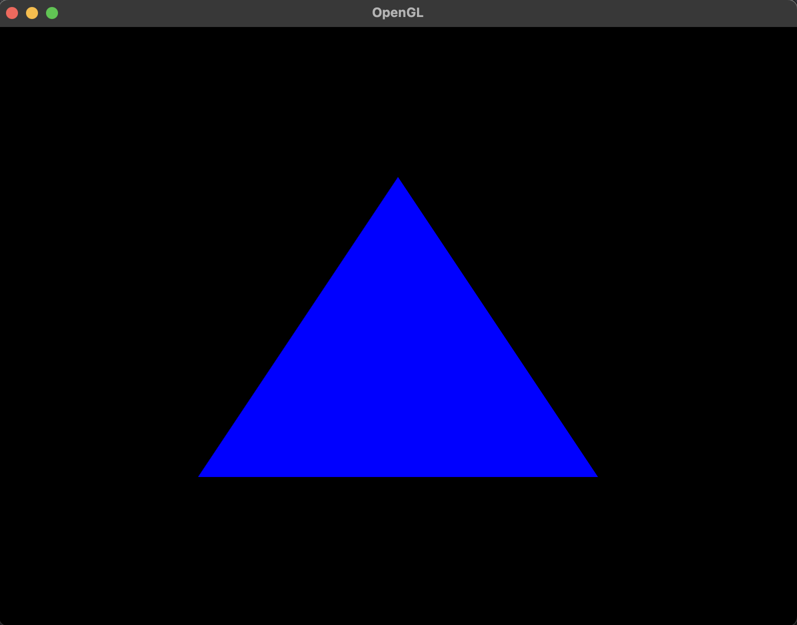
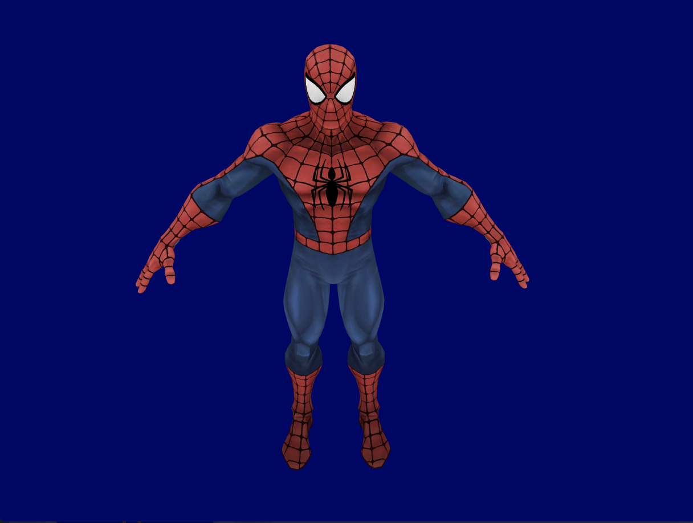
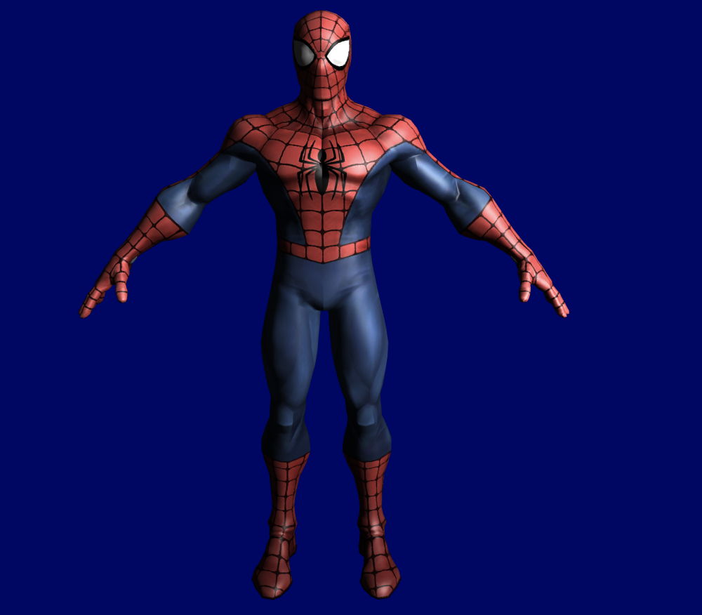
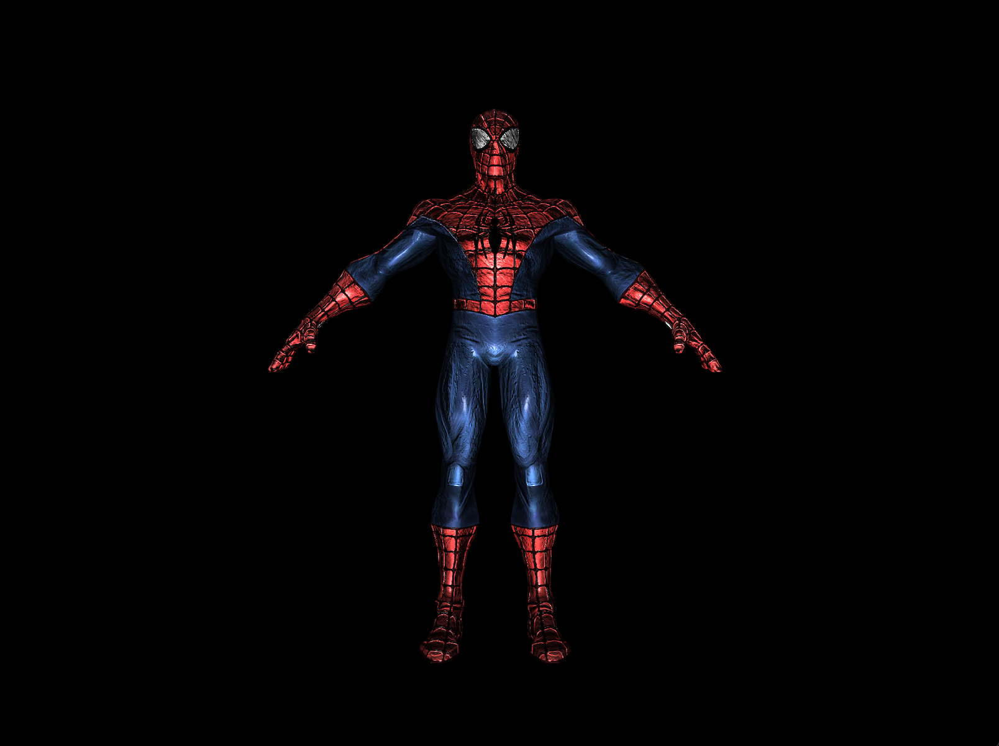
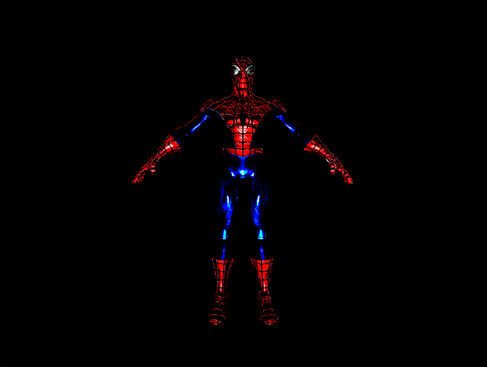
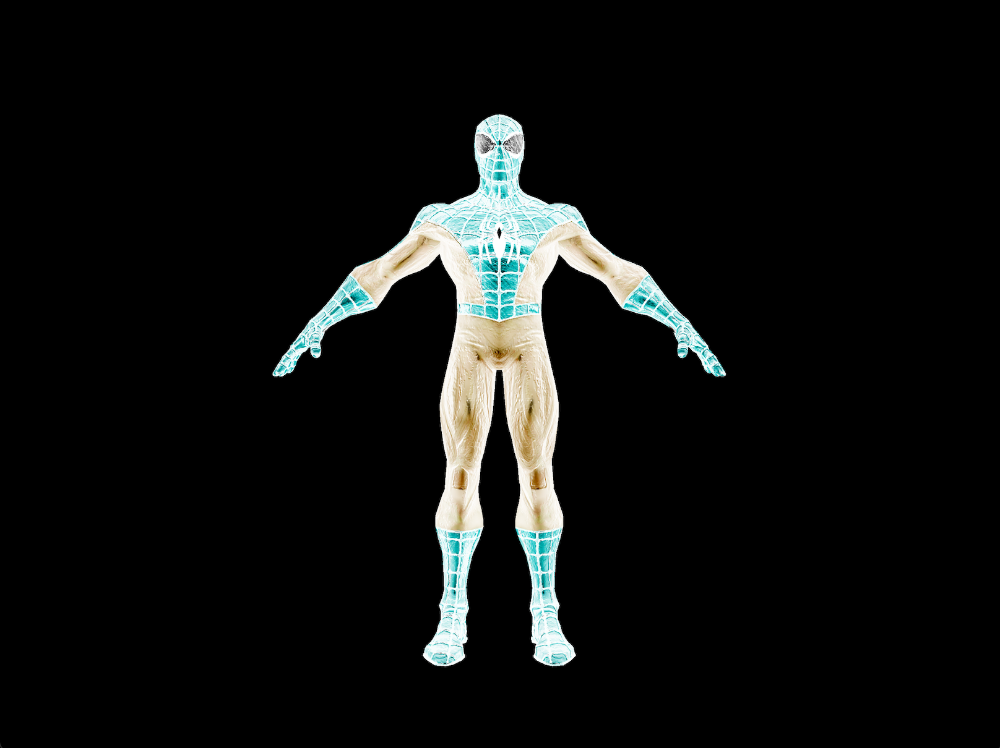
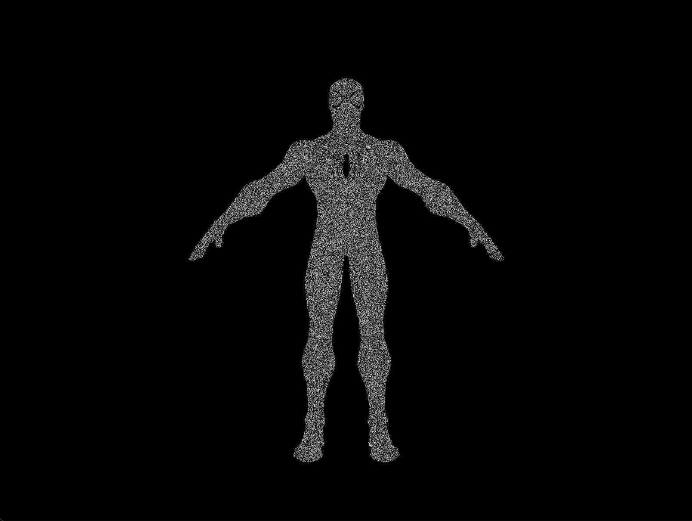

# OpenGL-C
UVG, Graphics course, OpenGl-C++.

I used some code and shaders from http://www.opengl-tutorial.org/beginners-tutorials/tutorial-2-the-first-triangle/ to do the "Hello world" and also for the Render project

<h1>Hello World </h1>

<h1> Project (Render)</h1>

 All the instructions about how to run and use this program are specified in a "Instructions.txt" file 

 Here a link to check functionality https://youtu.be/5KrLI7qjt3g

<h2> Spiderman - flat </h2>

<h2> Spiderman - Simple Shader </h2>

<h2> Spiderman - Normal Shader </h2>

<h2> Spiderman - Comic style Shader </h2>

<h2> Spiderman - Inverted colors Shader </h2>

<h2> Spiderman - Static (like no signal tv) Shader </h2>

