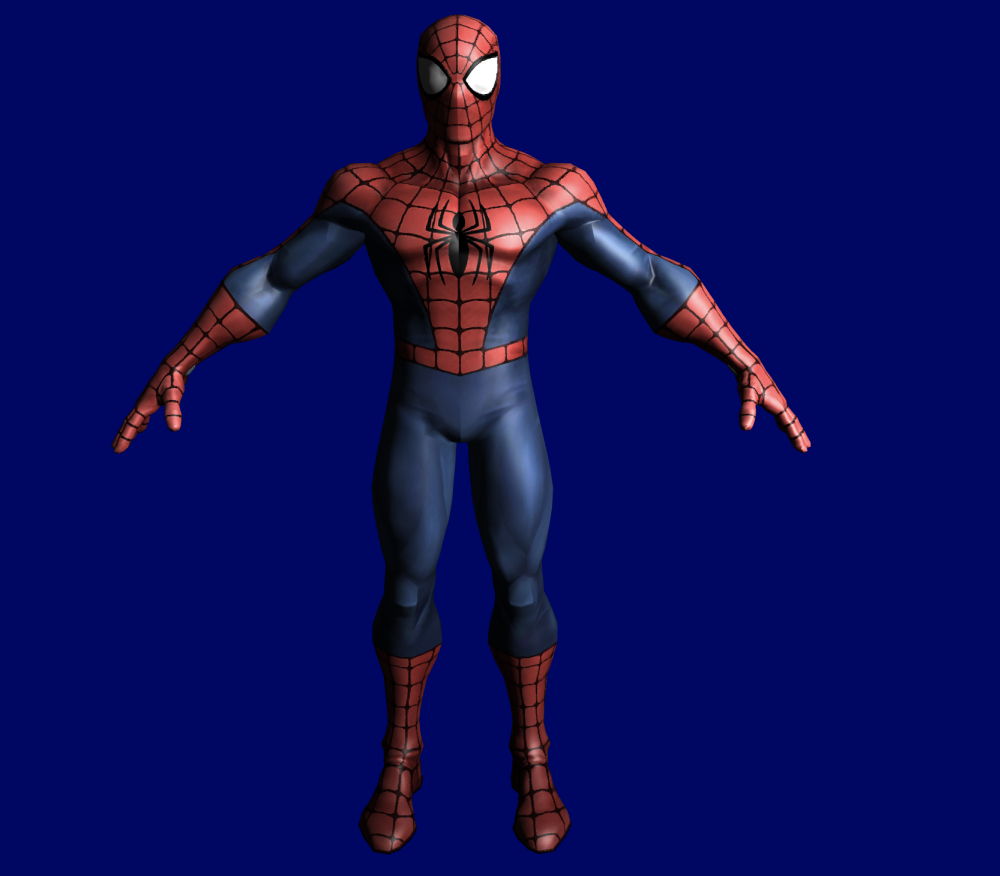

# OpenGL-C
UVG, Graphics course, OpenGl-C++.

I used some code and shaders from http://www.opengl-tutorial.org/beginners-tutorials/tutorial-2-the-first-triangle/ to do the "Hello world"

<h1>Hello World </h1>

<h1> Project (Render)</h2>

